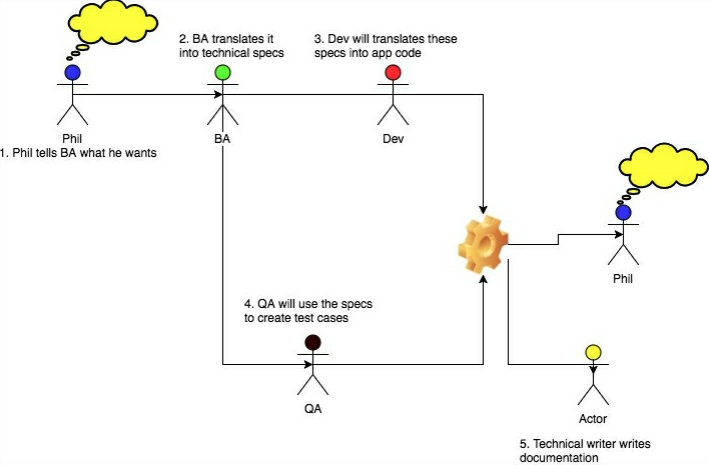
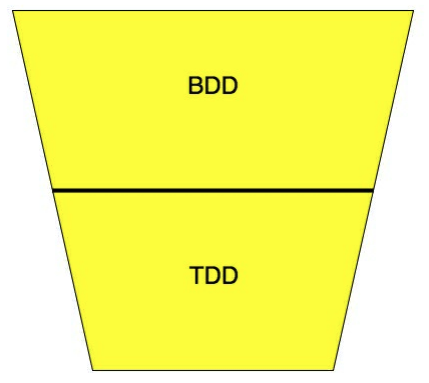
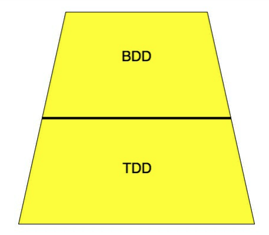
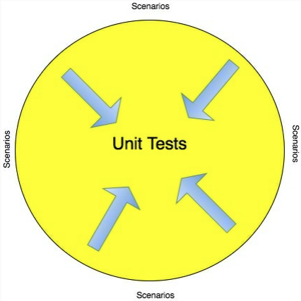
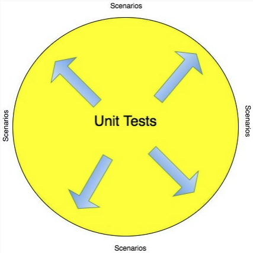
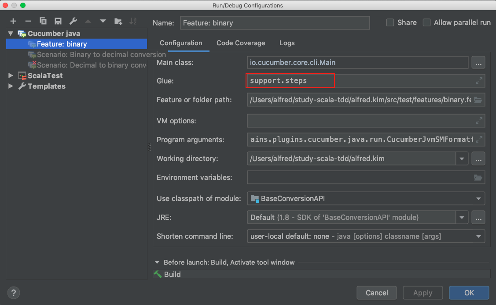

# CH5. Another Level Of Testing

* 유니트 테스트는 단지 TDD의 일부이다.

* 어느 시점에서 클래스는 어플리케이션 내의 다른 클래스들 또는 어플리케이션 외부의 다른 시스템과 상호작용을 할 필요가 있다.

* 이 장에서 우리는 어플리케이션의 통합과 기능 측면에서의 테스트를 돕는 다른 테스트 프로세스를 볼 것이다.

* 우리는 다음과 같은 주제들을 다룰 것이다.

  * Intergration testing 통합테스팅

  * Behavior-driven development (BDD)

    

## Intergration testing

* 소프트웨어 모듈의 개별적 요소들은 통합 테스트를 하는 동안 함께 테스트 하게 된다.
* 이 단계는 Unit Testing (단위 테스트) 와 Acceptance Testing(인수테스트) 사이에 놓여있다.
* 단위 테스트에서는 클래스 또는 메소드인지 여부에 관계없이 단일 코드 단위를 테스트 한다. 
* 개별 단위가 사양에 따라 작동하는지 확인한 후에는 통합 테스트로 시작하여 모듈 / 구성 요소가 내부 및 외부의 다른 구성 요소와 예상대로 동작하는지 확인할 수 있다. 
* 통합 테스트 프로세스는 다음 단계로 나눌 수 있다. 
  1. 상호 작용에 사용되는 단위 간의 인터페이스를 식별한다. 
  2. 완전한 End-To-End 통합을 가진 인터페이스가 있는 단위들의 집합을 지정한다. 
  3. 입력 및 예상 출력과 함께 통합 테스트 사례를 만든다. 
  4. 테스트를 평가하여 결과가 일치하는지 판별하고 결과를 기록한다.

## Functional testing

* 기능 테스트는 검증 활동으로 생각할 수 있다. 
* 블랙 박스 테스트의 한 유형이다. 
* 기능 테스트의 테스트 사례는 테스트중인 소프트웨어 시스템의 기능 요구 사항을 기반으로 한다. 
* 기능 테스트는 소프트웨어 시스템이 설계 사양에 따라 작동하는지 확인하는 최종 목표를 가지고 있다. 
* 기능 테스트가 블랙 박스 테스트라고 하면 입력을 제공하고 출력을 예상 출력과 비교하여 소프트웨어가 기능적으로 테스트됨을 의미한다. 
* 이것은 우리가 응용 프로그램의 기능 (방법)을 테스트하고 있음을 의미하지는 않습니다. 기능의 일부를 테스트하고 있음을 의미한다. 
* 기능 테스트와 관련된 단계 
  1. 테스트 할 기능을 식별한다. 
  2. 테스트 데이터를 작성한다. 
  3. 예상 출력을 확인한다. 
  4. 테스트 케이스를 실행한다. 
  5. 결과와 예상 결과를 비교한다. 
  6. 결과를 함께 합친다.

## Acceptance testing

* 인수 테스트는 최종 고객에게 더 중점을 둔다. 
* 이는 고객의 관점에서 애플리케이션이 테스트되었음을 의미한다. 
* 경우에 따라 고객이 테스트에 참여하고 테스트는 실제 프로덕션 시스템에 가능한 한 실제와 같은 환경에서 수행된다. 
* 인수 테스트 중에 각 사용자 요구 사항은 객관성, 구현, 오류 처리 및 사용자 요구에 따른 기타 세부 사항에 중점을 둔 테스트 사례를 사용하여 테스트된다.

## Need for user acceptance testing

* 애플리케이션이 단위, 통합 및 기능 테스트를 거쳤음에도 불구하고 고객의 애플리케이션 관점과 동일한 애플리케이션에 대한 개발자 또는 QA의 관점에는 항상 차이가있을 수 있다. 

* 개발자가 테스트를 작성할 때 요구 사항에 대한 자체 이해를 고려한다. 고객이 요청한 것과 동일하거나 동일하지 않을 수 있습니다. 이는 의사 소통이 잘못되었거나 고객과 개발자 사이에 공용어가 부족한 결과 일 수도 있다. 

* 더 자주 그렇지 않은 것은 진화 한 요구 사항이며, 이러한 변화는 효과적으로 전달되지 않았을 수 있다. 

* 응용 프로그램이 프로덕션 환경에 들어가기 전에 이러한 불일치를 확인하는 것이 좋다. 

* 다음은 사용자 승인 테스트 단계이다.

  1. 비즈니스 요구 사항을 분석한다. 

  2. UAT 테스트 계획을 작성한다. 

  3. 테스트 시나리오를 식별한다. 

  4. UAT 테스트 사례를 만든다. 

  5. 테스트 데이터 (프로덕션과 유사한 데이터)를 준비한다. 

  6. 테스트 케이스를 실행한다. 

  7. 결과를 기록한다.

     

## Behavior-driven development

* 행동 중심 개발 (BDD)은 현대 소프트웨어 산업 사전의 새로운 유행어이다. 
* BDD가 테스트 기술의 왕이 라는 것이 과장인지 아닌지 모르지만 개발 과정에서 제품의 전반적인 성공에 있어 몇 가지 중요한 개선이 있는 것으로 보인다.

### Introduction 

2007 년 스웨덴은 Försäkringskassan SAP라는 치과 건강 서비스 시스템 개발을 위해 약 100 억 SEK의 예산을 책정했습니다. 2010 년에 이 제품은 목적에 맞지 않고 예산을 초과하여 운영되고 있음을 알게 되었습니다. 따라서 이 프로젝트는 폐기되었습니다. 아 웃소싱 파트너와 아웃소싱 파트너 모두 서로를 고소했습니다. 이것은 수백만 달러의 비용이 드는 재난으로 수백만 달러의 프로젝트 중 하나에 불과합니다. 이것은 소프트웨어 산업에서 많이 발생합니다. 소프트웨어 프로젝트의 거의 절반이 어떤 방식 으로든 실패하는 것으로 추정되었습니다. 

* BDD의 필요성은 이러한 문제에서 비롯됩니다. 

* BDD는 가장 중요한 일에 큰 노력을 집중 시키려고 노력합니다. 

* 최대한 비즈니스 가치를 유지하는 기능을 객관적으로 보고 가장 비용 효율적인 방식으로 제공하는 것을 목표로 한다.

* BDD는 개발 프로세스의 대안이 아니지만 보다 나은 프로세스를 구축합니다.

### Three amigos (세명의 친구들)

* BDD의 핵심은 고객, 개발자 및 테스터를 처음부터 끝까지 참여시키는 것이다. 
* 세 명이 함께 앉아서 모든 면에서 이해할 수있는 공통 언어 (유비쿼터스 언어)를 정의한다
* 그 이후로 모든 요구 사항이 이 언어로 번역되고 개발은 이 번역 된 기능에 의해 설정된 전제에서 시작된다. 
* 이 모델을 종종 "세명의 친구"또는 "세가지 세력"이라고합니다. 
* 여기서 셋은  고객 (또는 고객의 대리자로 앉아있는 비즈니스 분석가), 개발자 및 QA를 나타낸다. 
* 이 세 명 모두 서로 다른 종류의 전문 지식과 관점을 제공한다. 
  * 고객은 비즈니스 지식과 기능이 무엇을 원하는지에 대한 명확한 아이디어를 제공합니다. 
  * 개발자는 기술 전문 지식을 도입하여 고객의 기대와 전체 응용 프로그램 설계를 조정하여 고객이 "약속의 땅"을 믿지 않도록하고 개발자가 불가능한 솔루션을 개발하도록 요청하지 않도록 한다. 
  * QA는 고객의 요구 사항과 개발자의 기술 사양을 쉽게 테스트하고 확인할 수있는 형식으로 만드는 데 도움이됩니다.
    

## Bird's-eye view of BDD

일반적인 개발 프로세스의 예를 살펴보고 BDD가 어디에 적용되는지 확인하자. 

Phil의 회사는 법률의 일부 변경으로 인해 현재 급여 시스템에 새로운 기능이 추가되기를 원한다고 가정한다. 

프로세스는 다음과 같이 진행됩니다. 

 1. Phil은 비즈니스 분석가에게 기능의 작동 방식을 알려줍니다. 

 2. 비즈니스 분석가는 Phil의 요구 사항을 개발자를위한 기술 사례 또는 사양으로 변환합니다. 

 3. 개발자는  기술 요구 사항을  Scala 코드로 변환하고 단위 테스트를 작성하여 코드가 탄탄한지 확인한다. 

 4. QA는 요구 사항을 테스트 케이스로 변환하고 개발자가 작성한 코드가 이러한 테스트 케이스를 충족하는지 확인한다. 

 5. 기술 작성자(Technical Writer) 는 응용 프로그램 코드를 설명서로 변환합니다. 

    

이 프로세스에는 정보를 잃을 수있는 많은 부분이 있다.

모든 사람이 스스로 작업하고 자신의 번역을 어느 정도 수행하므로 모든 지점에서 잘못 해석하거나 과도하게 엔지니어링 할 가능성이 있습니다. 

Phil의 회사가 BDD를 사용하고 있다고 가정 하고 이 과정이 어떻게 보이는지 보자.

1. Phil은 BA와 이야기하면서 자신이 구축해야 할 것을 말한다. 오해를 제거하기 위해 기능의 특정 예가 제공됩니다. 

2. 개발이 시작되기 전에 세  amigo (Dev, QA 및 BA)가 모여 이러한 요구 사항을 시나리오로 변환한다. 
   시나리오는 Phil, BA, Dev 및 QA가 모두가 이해할 수있는 것으로 동의 한 언어로 작성된다. 
   이 시점에서 기능을 이해하는데  결함을 제거하기 위하여 Phil과 지속적으로 의사 소통을 한다. 
   유비쿼터스 언어는 "Gherkin"이라고도 한다.  

3. 개발자는 이러한 시나리오를 일련의 자동화 테스트로 전환한다. 이 테스트는 기능의 경계와 요구 사항을 표시하며 기능이 완료되었는지 확인하는 데 사용할 수 있다. 

4. QA는 시나리오 및 자동화 테스트의 테스트 사례 작성의 시작점이 된다. 

5. 개발자는 모든 자동화 테스트가 통과되도록 응용 프로그램 코드를 작성합니다. 

6. 자동화 테스트 및 시나리오는 시스템의 저수준 문서화의 역할도 한다. 시스템이 어떻게 작동해야하는지에 대한 좋은 예를 제공 할 수 있다

   

BDD 프로세스가 더 협업적임을 알 수 있다. 모든 사람이 요구 사항을 모든 수준에서 이해할 수있는 언어로 번역하기 위해 함께 노력한다. 모든 요구 사항에 대해 모두 같은 페이지에 있다. 이러한 요구 사항은 또한 제품을 과도하게 엔지니어링 할 위험을 최소화하며 시나리오 중심의 자동화 테스트에서 설정 한 경계에 따라 개발 노력이 제한된다. 유비쿼터스 언어로 작성된 이러한 시나리오는 문서 역할을하며 제품과 함께 많은 문서가 필요하지 않다. Phil도 프로세스에 참여하고 있으며 언제든지 시나리오를 읽고 자신을 위해 무엇을 빌드하고 있는지 확인할 수 있다. 어떤 시점에서든 동의하지 않으면, 돈을 낭비하면서 성능이 좋지 않고 사용할 수없는 시스템이 구축되기를 기다리지 않고 즉각적인 변경을 요청할 수 있다.

### Gherkin

* 시장에 나와있는 거의 모든 BDD 도구는 영어와 같은 형식을 사용하여 요구 사항을 정의하고 자동 수락 테스트를 수행한다

* 이 형식은 비즈니스, 개발자, 비즈니스 분석가 및 QA와 같은 모든 이해 관계자가 쉽게 이해할 수 있도록 설계되었다.

*  이 형식을 "Gherkin" 이라고 한다. 엄밀히 말하면 Gherkin은 Cucumber BDD 도구 제품군에서 사용하는 형식을 나타내지 만 Gherkin이 주도하는 JBehave 승인 테스트를 작성하는 것이 가능해졌다. 

* 참고로 Cucumber는 다양한 플랫폼을 지원하는 BDD 프레임 워크이다. Cucumber에서는 애플리케이션 코드를 설명하는 매우 높은 수준의 사양을 작성하여 통합 테스트를 작성할 수 있다.

* 이러한 고급 사양은 일반 텍스트로되어 있다. 오이에 대한 자세한 내용은 https://cucumber.io/를 참조.

*  JBehave는 BDD의 또 다른 인기 프레임 워크입니다. 그러나 이름에서 알 수 있듯이 Java 및 관련 언어 (예 : 스칼라)와 더 밀접하게 연관되어 있다. JBEhave에 대한 자세한 정보는 http://jbehave.org/를 참조. 

* Gherkin에서 기본 요구 사항은 동일한 기능이 기능 파일이라는 동일한 파일에 함께 있어야한다는 것이다. 이 기능 파일에는 기능에 대한 간단한 설명과 모든 시나리오 목록이 포함되어 있다. 

* 이러한 시나리오는 기능의 작동 방식과 각 기능에 대해 의도 된 동작이 무엇인지에 대한 문서이다. 우리는 Gherkin을 사용하여 2 장, 첫 번째 TestDriven 응용 프로그램과 3 장, ScalaTest를 사용한 코드 정리에서 작성된 예제 응용 프로그램의 시나리오를 작성한다. 

* 다음은 Gherkin에서 기능을 작성하기위한 템플리트로 사용할 수있는 매우 일반적인 형식이다.

  **Feature**: Some terse yet descriptive text of what is desired. 
       In order to realize a named business value As an explicit system actor. 

  ​     I want to gain some beneficial outcome that furthers the goal

  **Scenario**: Some determinable business situation 

  ​	**Given** some precondition 

  ​    **And** some other precondition 

  ​	**When** some action by the actor

  ​    **And** some other action 

  ​	**And** yet another action 

  ​	**Then** some testable outcome is achieved 

  ​	**And** something else we can check happens too 

  

  **Scenario**: A different situation

  ...

* 예제

  **Feature**:  시스템 HR 관리자로서 정확한 보수를 결정하기 위해 직원에 대한 정확한 급여를 생성하고 싶다.

  ​	**Scenario**: 직원이 무급 휴일이 있을 때

  ​		**Given**  Jairus라는 직원이 있다. 

  ​		**And** Jairus는10일간의 무급휴일이 있다. 

  ​		**When** HR 매니저가  급여를 생성한다.

  ​		**And**  2016년 2월에 대한 급여이다.

  ​		**Then** 정확한 급여가 생성된다.

  ​		**And**  급여는 무급휴일에 대한 보수가 공제된다. 

  ​	**Scenario**:  직원이 무급 휴일이 없을때 .

* featuer file은 일반적으로 .feature 확장자로 저장된다. 

* 마지막 예제에서 Gherkin 요구 사항이 일반 영어로 제공되지만 특정 구조가 있음을 알 수 있다. 

* 모든 시나리오는 여러 단계로 구성된다. 

* 각 단계는 키워드 중 하나 (Given, When, Then, And 및 But)로 시작한다. 

* Given은 시나리오의 전제 조건을 정의한다. 테스트 환경을 준비하거나 데이터를 준비하는 데 사용됩니다. 

* When은 행위자가 취한 행동을 설명한다. 

* Then은 예상 결과 또는 동작을 설명한다. 

* Gherkin을 사용하면 여러 연관된 시나리오를 입력 테이블에 의해 구동되는 단일 시나리오로 모을 수 있다. 

* 이것을 시나리오 개요라고 한다. 예를 들면 다음과 같다.

  **Scenario Outline**: Calculate sum 

  **Given** I have two numbers \<number-one\> and  \<number-two\>

   **When** these numbers are added 

  **Then** I should have the correct total  \<sum\>

  **Examples:** 

  | number-one | number-two | sum | 

  | 10000 | 20000 | 30000 |

  | 10000 | 40000 | 50000 |

* 참고 : https://cucumber.io/docs/gherkin/reference/

### Executable specification

Gherkin으로 작성된 이러한 feature들은  Step definition를 통해 실행 가능한 Executable specfication을 형성한다. 

Step definition은 스텝들 아래에 있는 실행되는 코드이다. 

이 Executable specfication은 인수 테스트, 통합 테스트 또는 단위 테스트 중에 작성된 테스트 사례보다 자연 언어에 더 가깝다.  따라서 응용 프로그램 코드를 어떻게 사용해야하는지 예를 들 수 있다. 또한 요구 사항에 대한 종합적인 이해에 대한 문서이다.

### Don't repeat yourself

BDD를 사용할 때 스펙 레벨과 단위 레벨 모두에서 동일한 테스트를 반복하는 경우가 있을 수 있다. 

단위 수준에서 얼마나 테스트해야하는지, 사양 수준에서 얼마나 테스트해야하는지에 대한 다른 유파들이 있다. 

한 유파는 최소한의 단위 테스트를하면서 가능한 한 많은 사양을 문서화해야한다고 생각합니다. 이 유파의 개발자 그룹은 모든 또는 대부분의 테스트가 비즈니스와 통신 할 수있는 방식으로 문서화되어야한다고 생각합니다. 이것은 역 사다리꼴로 시각화 할 수 있다.

또 다른 유파는 BDD 사양에 합격 기준 만 있고 광범위한 단위 테스트 범위를 가지고 있다고 생각합니다. 이 유파의 개발자 그룹은 테스트가 가능한 한 실제 코드에 최대한 가깝게 타겟팅되어야한다고 생각합니다. 이것은 사다리꼴로 상상할 수 있다.

이 두 가지 접근 방식 모두 장단점이 있으며 어느 것도 잘못된 것이 아닙니다. 중간 지점을 찾는 것은 독자의 몫이다. 나는 더 많은 단위 테스트와 적절한 수의 사양을 가지고 있어 응용 프로그램 코드의 모든 기능이 문서화되도록 옹호합니다. 이유는 단위 테스트를 실행하는 데 필요한 인프라 코드가 적고 시나리오를 실행하려면 초기화해야 할 고정 장치가 적지 않기 때문이다. 

스칼라 테스트를 통해 인터리브 단계 정의를 구성하는 방식으로 단위 테스트를 작성할 수 있습니다. BDD 스타일로 단위 테스트를 작성하는 열렬한 BDD 십자군이 이것을 사용할 수 있습니다. 

BDD를 어떻게 사용해야하는지에 대한 두 가지 다른 유파가 있습니다. 

한 유파는 (BDD 십자군)는 BDD 시나리오를 수행하기 위해 응용 프로그램 코드를 작성해야하며, 결국 단위 테스트에 도달해야한다고 생각합니다. 즉, BDD 시나리오를 작성하고 시나리오를 이행하기 위해 최소한의 애플리케이션 코드를 작성합니다. 그런 다음이 시나리오를 만족시키기 위해 더 많은 시나리오를 추가하고 더 많은 애플리케이션 코드를 작성합니다. 단위 테스트는 필요할 때마다 채워지지만 BDD는 TDD와 같은 방식으로 Red-Green-Refactor로 수행됩니다. 이 접근 방식을 사용하면 언제든지 녹색 테스트를 수행 할 때 단위 테스트와 BDD 시나리오가 모두 통과합니다. 리팩토링은 모든 수준에서 가능한 한 무자비하게 수행됩니다.

다른 생각의 유파 (TDD 숭배자)는 BDD 시나리오를 작성한 후에 응용 프로그램을 내부에 작성해야한다고 믿습니다. 즉, TDD를 사용하여 응용 프로그램 코드를 작성한 다음 최종 목표가되도록 응용 프로그램을 작성해야합니다. BDD 시나리오가 이행된다는 것을 이 방법에서는 단위 테스트를 통과 할 수 있지만 TDD가 여전히 진행 중이므로 BDD 시나리오는 계속 통과하지 못합니다.

### Talk is cheap 

우리는 BDD에 대해 충분히 이야기했습니다. 직접 운전대에 손대는 것 이외에 다른 대안은 없습니다. Cucumber를 사용하는 예제 애플리케이션에서 BDD 시나리오 설정을 살펴 보겠습니다. SBT 빌드 디스크립터에 포함해야 할 Cucumber 라이브러리 종속성을 소개해야합니다. Cucumber와 함께 JUnit에 대한 종속성도 필요합니다. JUnit을 사용하여 Cucumber를 SBT와 통합하는 것이 항상 더 쉬웠 기 때문입니다. Cucumber 및 SBT 통합을 허용하는 타사 SBT 플러그인도 있지만 LightBend (이전의 TypeSafe)에 의해 유지 관리되지 않으므로 최신 Scala 및 SBT 버전으로 최신 상태가 아닙니다.

* 참고 링크 
  * cucumber-scala 
    * https://cucumber.io/docs/installation/scala/
    
    * https://github.com/cucumber/cucumber-jvm-scala
    
      
* intelliJ IDEA 에서 cucumber-java 실행
  
  * glue 설정 : step 구현체가 있는 패키지명 설정 필요
  
    
  
* cucumber-scala version up 
  * AS-IS
    * build.sbt : libraryDependencies +="info.cukes" %% "cucumber-scala" % "1.2.4" % Test
    * package name : import cucumber.api.scala.{EN, ScalaDsl} 등
    * Run test main class : cucumber.api.cli.Main 
  * TO-BE
    * build.sbt : libraryDependencies += "io.cucumber" %% "cucumber-scala" % "6.1.1" % Test
    * package name : import io.cucumber.scala.{EN, ScalaDsl}
    * Run test main class :io.cucumber.core.cli.Main
  