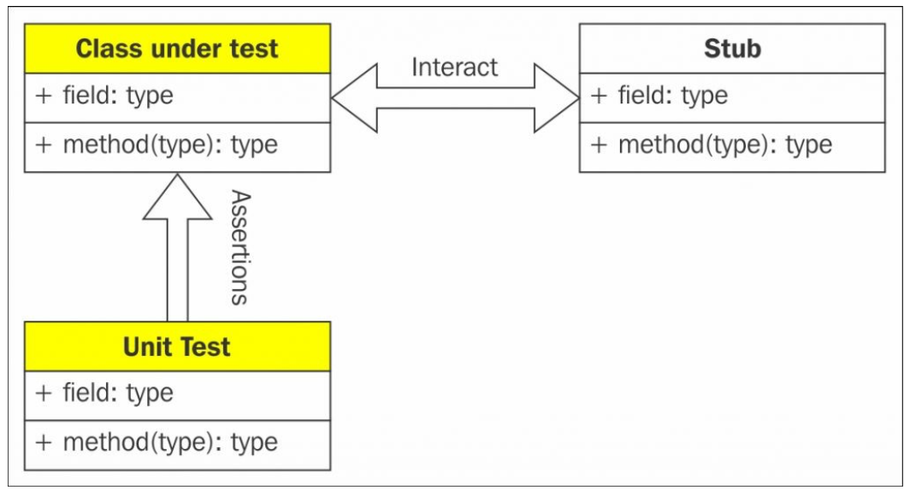
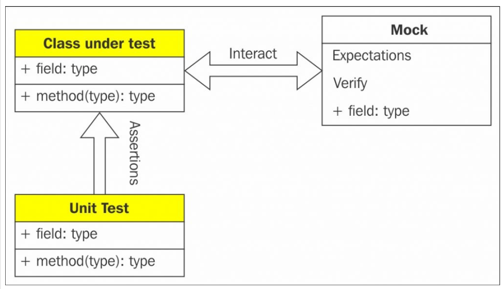
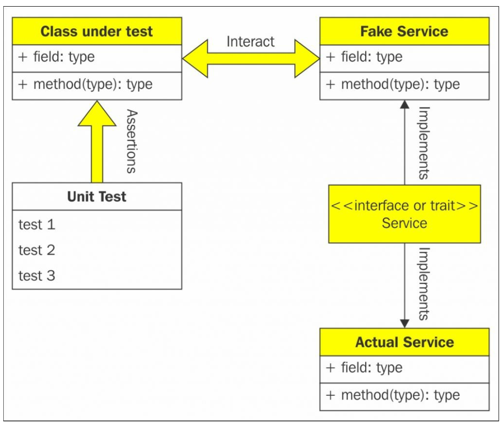

# Chapter 6. Mock Objects and Stubs

Mock과 Stub은 TDD, BDD에 필수적이다.

```
'목 객체 (Mock Objects)'라는 용어는 테스트를 위해 실제 객체를 모방하는 특수 사례 객체를 설명하는 데 널리 사용된다. 대부분의 언어 환경에는 목 객체를 쉽게 만들 수있는 프레임워크가 있다. 그러나 종종 깨닫지 못하는 것은 목 객체는 특별한 스타일의 테스트 객체의 한 형태 일 뿐이며 다른 스타일의 테스트를 가능하게한다는 것이다.
- 마틴 파울러
```


## History

## Coupling

소프트웨어 용어에서 커플링은 서로 다른 모듈 간의 상호 의존성 접합을 나타낸다. 이는 한 루틴의 변경이 다른 루틴에 미치는 영향을 측정한다. 타이트 커플링과 루즈 커플링이라는 두 가지 유형으로 구분한다. 두 모듈에 케스케이드하게 영향을 미치거나, 독립적으로 한 모듈을 변경할 수 없는 경우 두 개의 모듈이 밀접하게 연결된 타이트 커플링으로 판단한다. 반대로, 한 모듈이 변경되어 다른 모듈이 거의 또는 전혀 변경되지 않으면 루즈 결합 된 것으로 간주된다.
커플링은 코드의 테스트 가능성에서 중요한 역할을 한다. 코드가 느슨하게 결합 될수록 더 테스트 가능하다. 커플링을 줄이거나 제거하는 것이 항상 쉬운 것은 아니지만 의존성 주입이 도입 되어 모듈을 독립적으로 테스트하는 것이 더 쉬워졌다.

느슨한 결합을 사용하더라도 클래스 B 및 C와 느슨하게 결합 된 클래스 A를 테스트 할 때는 클래스 B 및 C의 인스턴스를 작성해야 할 수도 있다. 이부분은 목 오브젝트 및 스텁으로 채울 수 있다.

## Stubs

스텁은 미리 결정된 입력 세트를 기반으로 미리 정의 된 결과를 생성하는 객체이다. 스텁은 사용법이 매우 제한적이다. 예를들어 문자열 "CK65ZSR"로 호출 할 때마다 "Land Rover Discovery Sports"를 반환하는 스텁을 생성하면 이 작업으로 만 제한되고, 다른 문자열로 호출하면 무엇을 해야할지 모른다. 이 경우 스텁 구현에 따라 오류가 발생하거나 null을 반환 할 수 있다. 스텁은 활용도를 높이기 위해 호출 된 횟수와 매개 변수를 기억해 스텁의 동작을 확인할 수 있게 한다.



## Mock objects

스텁과 마찬가지로 목 객체도 미리 설정된 값을 반환합니다. 이 외에도 목 객체는 목 호출 횟수와 호출 순서에 대한 기대치를 프로그래밍 할 수 있다. 목 객체를 사용하면 실제 클래스를 사용하지 않고 클래스 간의 상호 작용에 대한 특정 세부 정보를 테스트할 수 있다.

### Expectations

목 객체에 대한 기대치를 설정하여 동작을 정의한다. 또한 기대하는 것은 테스트 중 인 클래스가 예상대로 작동한다고 단언하는 방법입니다. 예외는 예상 응답, 메소드 호출 순서 또는 예상 된 오류를 설정할 수 있다. 일반적으로 예상은 목 객체의 동작을 설정한다. 하나 이상의 기대 값이 호출되지 않으면 테스트 실패가 발생하지 않는다.

예 : 목 객체를 세 번 호출 할 것으로 예상하고 실제 테스트는 한 번만 호출 한다고 해도 실패하지 않는다. > 검증 과정에서 실패한다.

### Verifications

목 객체에 대한 검증은 기대가 충족되는지 확인하도록 설정된다. 이는 기대가 예상대로 호출(invoke) 되도록 하기 위한 것이다. 기대치 검증은 테스트가 완료되면 목 객체가 실제로 예상 된 방식으로 작동하는지 확인한다.
기대치에 호출 횟수를 세번으로 설정했는데 실제 테스트에서 한번만 호출 한 경우 테스트에 실패하게 된다.



## Fakes

페이크 객체는 인터페이스 또는 트레잇의 실제 구현이다. 이 구현은 프로덕션 방식이 아니라 숏컷을 사용한다. 따라서 페이크 개체는 테스트 영역(harness)에 국한되어 프로덕션 코드에 적용되지 않습니다.
페이크는 멍청한 구현이며 기대와 검증의 개념이 없다. 페이크는 의존성 행동의 상호 작용이 클라이언트 테스트에 집중하는 테스트의 문제가 되어서는 안된다는 생각에서 시작된다.



## Spy

스파이는 행동 확증 측면에서 목 객체와 다르다. 스파이는 로거처럼 행동하며 행동 기대치를 설정하는 대신 코 워커에게 호출된걸 기록한다. 단위 테스트는 나중에 스파이로부터 로그를 확인합니다.

## Mocking frameworks

### JMock

JMock은 자바 TDD를 지원하기 위해 만들어졌으며 목 객체와 스텁을 제공하며 스칼라에서도 이용 가능하다. 

#### Advantages of JMock

* 자바에서 스칼라로 전환이 쉬움
* 셋업과 사용이 쉬움
* 어노테이션 지원
* 객체간 상호작용 정의
* 대부분의 IDE 에서 지원
* ScalaTest, Specs2와 쉬운 연결
* 확장 가능

ScalaTest에는 JMockCycle 클래스가 있으며, 이 클래스는 JMock Mockery (org.jmock.Mockery) 객체의 수명주기를 캡슐화한다. JMockCycle은 JMock을 Scala와 함께 사용할 수 있도록 시멘틱 슈가를 제공한다.
JMock for Java를 사용하는 경우 일반적으로 다음과 같은 Mockery 컨텍스트 오브젝트를 작성합니다.

```
val context = new Mockery
context.setImposteriser(Collaborator.INSTANCE)
```

이를 JMockCycle 을 이용하면 다음과 같다

```
val cycle = new JMockCycle
import cycle._
val mockCollaborator = mock[Collaborator]
```

JMockCycle을 사용한 일반적인 테스트는 다음과 같다.

```

val cycle = new JMockCycle
import cycle._

val mockCollaborator = mock[Collaborator]

expecting { e => import e._
	oneOf (mockCollaborator).addToTotal(200)
	exactly(3).of (mockCollaborator).addedToTotal(200)
}

whenExecuting {
	classUnderTest.addToTotal(200)
	classUnderTest.addToTotal(200)
	classUnderTest.addToTotal(200)
}
```

expecting 메소드는 새 Expectations 인스턴스를 작성하여 사용자가 제공 한 함수에 전달하여 기대치를 설정합니다. 함수가 리턴하면 리턴 된 Expectations 오브젝트가 Mockery의 점검 메소드로 전송됩니다.
whenExecuting은 전달 된 함수를 실행 한 다음 Mockery 컨텍스트 개체에서 asserIsSatisfied를 호출하여 확인합니다.

### EasyMock

이름에서 알 수 있듯이 EasyMock은 목 객체를 동적으로 생성하여 훨씬 더 편리하다. EasyMock은 Java 프록시 메커니즘을 사용하여 목 객체를 동적으로 생성한다. JMock과 유사하게 EasyMock은 원래 test-driving Java 코드 용으로 작성됐다. ScalaTest는 EasyMock을 사용하여 test-driving scala 코드를 사용할 수 있는 신멘틱 슈가를 추가하는 EasyMockSugar 트레잇을 제공한다.
EasyMock을 사용한 일반적인 테스트는 다음과 같다.

```
val mockCollaborator = mock[Collaborator]

expecting {
	mockCollaborator.documentAdded("Document")
	mockCollaborator.documentChanged("Document")
	lastCall.times(3)
}

whenExecuting(mockCollaborator) {
	classUnderTest.addDocument("Document", new Array[Byte](0))
	classUnderTest.addDocument("Document", new Array[Byte](0))
	classUnderTest.addDocument("Document", new Array[Byte](0))
	classUnderTest.addDocument("Document", new Array[Byte](0))
}
```

whenExecuting이 mockCollaborator를 전달하면 목 을 사용하는 코드를 실행하고 목 을 검증하기 위해 재생합니다. whenExecuting을 사용하면 여러 모의 객체를 전달할 수도 있습니다. 선택적 expecting 절은 목에 대한 기대치를 설정하는 진술을 나타냅니다.
재생은 모의 설정을 마치고 사용할 준비가되었음을 나타냅니다.

###  Mockito

ScalaTest의 MockitoSugar는 ScalaTest와 함께 Mockito를 사용하기 위한 시멘틱 슈가를 제공한다. 경험상 Mockito가 모든 프레임 워크 중에서 가장 사용하기 쉬웠다. 단순히 mock [ServiceClass]를 사용하여 ServiceClass에서 mock을 쉽게 만들 수 있다.
Mockito는 이해하기 쉬운 테스트 형식으로 구성된다. 이것이 jMock과 EasyMock보다 인기가있는 이유 중 하나라고 생각한다.
Mockito를 사용하여 jMock 및 EasyMock에서와 동일한 작성해보겠다. 

```
// First, create the mock object
val mockService = mock[ServiceClass]

// Create the class under test and pass the mock to it
classUnderTest = new ClassUnderTest
classUnderTest.addService(mock)

// Use the class under test
classUnderTest.createPayroll("Person1", 1000)
classUnderTest.createPayroll("Person1", 4000)
classUnderTest.createPayroll("Person1", 6000)
classUnderTest.createPayroll("Person1", 19000)

// Then verify the class under test used the
// mock object as expected
verify(mockCollaborator).createInitalPayroll("Person1")
verify(mockCollaborator, times(3)).changePayroll("Person1")
```

### ScalaMock

ScalaMock은 아마도 Scala가 Java와 다른 언어라는 것을 이해 한 최초의 목킹 프레임워크 일 것이다. 스칼라는 기능적(functional) 코드와 객체 지향 코드를 모두 허용한다는 사실이 있고, 따라서 스칼라를 위한 목킹 프레임워크는 스칼라 클래스의 측면에서 이 둘을 목킹 할 수 있어야 한다.
기본 프레임워크이며 함수와 객체를 모두 목킹 할 수 있다. Paul Butcher이 만들었다.

#### Advantages of ScalaMock

* Type safe
*  Open source
*  Support for Scala-specific features such as:
  * Operator methods
  * Method overloading
  * Pattern matching
  * Parameterized methods
* Compatible with both ScalaTest and Specs2

https://scalamock.org/quick-start/

ScalaTest 에서 ScalaMock을 활용하기 위해서는 테스트 스위트에 MockFactory 를 믹스인 하면 된다.

```
import org.scalatest.FlatSpec
import org.scalamock.scalatest.MockFactory

class BaseSuite extends FlatSpec with MockFactory with ...
```

#### mockFunction

함수는 mockFunction을 이용해 목 할 수 있다.

```
// Creates mock function which expects single Int parameters and returns a String
val m = mockFunction[Int, String]

// Then we set expectation on this mock that it is called once with parameter 86 and it returns "Eighty Six"
m expects (86) returning "Eighty Six" once
```

#### Proxy mocks

proxy mock은 스칼라의 트레잇과 자바 인터페이스를 목하기 위해 사용된다. ProxyMockFactory를 믹스인해 프록시 목을 만들 수 있다. 프록시 목을 이용하는 house 를 생성하고 테스트 동안의 기대값을 생성하는 예제이다.

```
val house = mock[Building]

house expects 'setNumberOfWindows withArgs (5)
house expects 'setNumberOfDoors withArgs (2)

house expects 'openDoor once
```

#### Generated mocks

생성 된 목은 스칼라 클래스를 목 하는데 사용한다. 이를 위해 ScalaMock 컴파일러 플러그인을 사용한다. 생성 된 클래스는 org.scalamock.annotation.mock 어노테이션을 사용하여 목 할 수 있다. org.scalamock.annotation.mockWithCompanion 어노테이션을 사용하여 클래스 및 해당 컴파니언 오브젝트를 목 할 수도 있다. 마찬가지로 org.scalamock.annotation.mockObject 주석을 사용하여 싱글 톤 객체를 목 할 수 있다.

#### Let's dig a little deeper

ScalaMock은 Scala를 사용한 TDD에 중점을 두고 책의 일부를 할애해 자세히 살펴볼 가치가 있다.

##### 기대치 명시

다른 목 프레임워크와 마찬가지로 ScalaMock은 withArgs 또는 withArguments를 통해 함수가 호출 될 인자에 기대치를 설정할 수 있다. 인자를 필수로 지정할 필요는 없으며, 인자가 지정되지 않은 경우 목은 임의의 개수/유형의 인자를 허용한다.
인자의 값은 다음 예에 따라 리터럴, 엡실론 (부동 소수점 숫자) 또는 와일드 카드로 지정할 수 있다.

```
house expects ("Knocks", 2)\
house expects ("Residents", *)
house expects ("Rent", ~1526)
```

**를 사용하여 반복되는 매개 변수를 기대치로 설정할 수 있다.

```
m expects 'takesRepeatedParameter withArgs
(42, **("red", "green", "blue"))
```

목은 리턴 값을 설정할 수 있다.

```
calc expects (2, 4) returning 6
```

목은 익셉션 생성도 설정할 수 있다.

```
calc expects (0, 2) throws new AirthmeticException("Divide by zero")
```


## Summary

개발자와 목 객체 사이에는 애증의 관계가 있다. 한편으로는 테스트 클래스를 독립적으로 테스트 할 수 있다는 이점이 있다. 이것은 또한 느슨하게 결합 된 아키텍처로 발전하며 코드 재사용 성이 더 높다. 
반면 목은 테스트 코드를 테스트중인 클래스의 실제 구현에 연결한다. 테스트 코드에 주요 리팩토링이 수행되면 테스트에서 목의 예상 및 검증이 변경 될 수 있다. 이것은 테스트 및 응용 프로그램 코드의 분리 원칙에서 벗어난다.
목 프레임워크는 올바르게 사용된다면 개발에 훌륭한 도구가 된다. 너무 많은 항목을 모두 목 하는 것보다는 조금 거리를 두고 목하는게 좋다.


